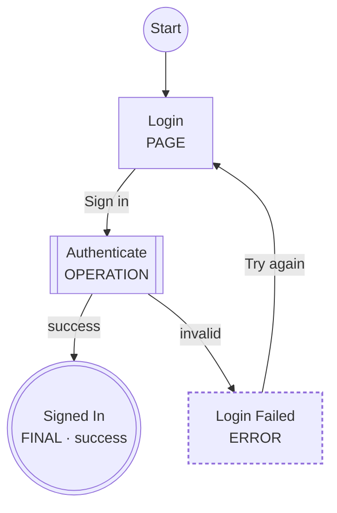

<p align="center">
  
</p>

[](https://github.com/shynfard/LogicSpec/actions/workflows/ci.yml)
[](https://www.npmjs.com/package/logicspec)
[](LICENSE)


**Define the logic. Validate it. Visualize it. Then build it.**

## Contents

- [What is LogicSpec?](#what-is-logicspec)
- [Why LogicSpec?](#why-logicspec)
- [Quick start (30 seconds)](#quick-start-30-seconds)
- [How an example works](#how-an-example-works)
- [The language](#the-language) — nine step types, [and beyond](#beyond-the-basics)
- [Using with AI coding agents](#using-with-ai-coding-agents) — Claude Code plugin, MCP server
- [VS Code extension](#vs-code-extension)
- [The dashboard (local website)](#the-dashboard-local-website)
- [CLI](#cli)
- [Workspace configuration](#workspace-configuration)
- [Linking catalogs to OpenAPI and AsyncAPI](#linking-catalogs-to-openapi-and-asyncapi)
- [Library API](#library-api)
- [Other integrations](#other-integrations)
- [Documentation](#documentation) · [Development](#development) · [Design principles](#design-principles) · [License](#license)

## What is LogicSpec?

LogicSpec is a small, open-source YAML DSL for describing **application feature logic** — booking, checkout, authentication, onboarding, approval workflows — *before* you implement them.

One feature file describes the whole behavior of a feature:

```text
Pages → Actions → Decisions → Backend Operations → Events → Outcomes
```

and the toolchain turns it into a validated, queryable model with always-up-to-date diagrams:

```text
YAML → Validate → Visualize → Implement
```

LogicSpec is a **design and specification tool**, not a workflow engine. Nothing is executed. Expressions are descriptive text. The YAML is the source of truth; generated Mermaid is documentation.

## Why LogicSpec?

Software teams (and AI coding agents) usually have requirements, designs and code — but no small, machine-readable source of truth describing how a feature actually *behaves*: which screens exist, what the user can do, which backend operations run, what happens on conflict, timeout, or failure.

* Generic flowcharts are visual but semantically weak — a box is just a box.
* Workflow engines are far too heavy for design work.
* Mermaid is great for *seeing* a flow, but a diagram is not a data model you can validate or query.

LogicSpec closes that gap. Describe the feature once, in YAML, with a small closed vocabulary of nine step types. Then:

* **Validate** it — structural schema checks plus graph-aware semantic analysis: unknown transitions, unreachable steps, dead ends, loops that can never finish, and data-flow analysis proving every required context variable is produced on every path. Stable diagnostic codes (`LS001`–`LS404`), "did you mean" suggestions, per-workspace severity overrides.
* **Visualize** it — deterministic Mermaid flowcharts, plus swimlane, sequence and event-model views, a workspace dependency graph, an interactive drag/zoom canvas in the dashboard and VS Code — all from the same YAML.
* **Query** it — `logicspec inspect --json`, `logicspec validate --json` and the built-in MCP server give tools and AI agents a stable, machine-readable model of every feature.
* **Compare** it — `logicspec diff` reports semantic changes between two versions of a flow, not textual ones.

And because output is deterministic (same YAML → byte-identical diagrams), specs diff cleanly in code review, exactly like code.

<p align="center">
  
</p>
<p align="center"><em>A real booking flow on the interactive canvas — per-actor colors with legend, ↓requires/↑produces data-flow chips, hover relation-tracing, minimap. All from plain YAML.</em></p>

## Quick start (30 seconds)

```bash
npm install -g logicspec
```

```bash
mkdir my-flows && cd my-flows

logicspec init                                  # scaffold config, catalogs, example feature
logicspec validate features/signup.feature.yaml # validate one file (or a directory)
logicspec render features/signup.feature.yaml   # generate .logicspec/signup.md with a Mermaid diagram
logicspec watch                                 # re-validate and re-render on every save
logicspec serve                                 # browse the workspace at http://127.0.0.1:27000
```

Prefer the editor? Install the **[LogicSpec VS Code extension](https://marketplace.visualstudio.com/items?itemName=Shynfard.logicspec-vscode)** — diagnostics as you type plus an interactive draggable canvas, no CLI required. Working with AI? The **[Claude Code plugin](#using-with-ai-coding-agents)** teaches your agent the whole language.

### Working from source

```bash
git clone https://github.com/shynfard/LogicSpec.git logicspec
cd logicspec
npm install
npm run build
npm link      # exposes the logicspec CLI from your checkout
```

## How an example works

Here is a complete login feature — every concept of the language in ~50 lines:

```yaml
version: "1"

feature:
  id: login
  name: Login
  description: User signs in.

start: login-page

actors:
  user: { kind: user }
  web: { kind: frontend, label: Web App }
  auth: { kind: service, label: Auth Service }

context:
  credentials: { type: object }
  sessionId: { type: string }

steps:
  login-page:
    type: page
    label: Login
    actor: web
    route: /login
    actions:
      submit:
        label: Sign in
        produces: [credentials]
        next: authenticate

  authenticate:
    type: operation
    label: Authenticate
    actor: auth
    call: auth.create-session
    requires: [credentials]
    produces: [sessionId]
    on:
      success: { next: done }
      invalid: { next: login-failed }

  login-failed:
    type: error
    label: Login Failed
    message: Invalid credentials.
    actions:
      retry: { label: Try again, next: login-page }

  done:
    type: final
    label: Signed In
    outcome: success
```

Reading it top to bottom:

1. **`start`** names the entry step — every flow has exactly one.
2. **`actors`** declare *who* participates (user, frontend, services…). Steps reference them, swimlane and sequence views group by them.
3. **`context`** declares the data that flows through the feature. Steps `produce` and `require` these keys — and the validator *proves* every `requires` is produced on **every** path that can reach it (diagnostic `LS203`). Delete `produces: [credentials]` above and validation fails, because `authenticate` can then run without credentials.
4. **`login-page`** is a `page`: a screen the user sees. Its `submit` action captures credentials and transitions to `authenticate`.
5. **`authenticate`** is an `operation`: backend work, resolved against the service catalog (`call: auth.create-session` must exist there — `LS104`). Its `on:` map names the possible outcomes and where each one leads. Typo the target — `next: autenticate` — and you get `LS101: unknown step. Did you mean "authenticate"?` with the exact line and column.
6. **`login-failed`** is an `error` with a recovery action back to the page; **`done`** is a terminal `final` with outcome `success`. Finals have no outgoing transitions — the validator enforces it.

`logicspec render` then produces a Markdown file containing:



Shapes and the type marker in each label carry the meaning, so diagrams stay readable in light themes, dark themes, print, and monochrome.

A complete real workspace lives in [`examples/booking/`](examples/booking/): two features (a booking flow and an event-driven notification flow), service and event catalogs linked to OpenAPI/AsyncAPI documents, severity overrides in the config, and generated output including the [workspace dependency graph](examples/booking/.logicspec/dependencies.md). The [examples README](examples/README.md) maps all six example workspaces to the concepts they demonstrate.

## The language

Nine step types — a deliberately closed vocabulary, one preferred way to express each concept:

| Type | Meaning |
|------|---------|
| `page` | A frontend screen or meaningful UI state, with user actions |
| `decision` | Branching business/application logic (descriptive, never executed) |
| `operation` | Meaningful backend/system work, resolved against the service catalog |
| `event` | Publish a domain event, or wait for one (with timeout) |
| `wait` | Intentional time delay |
| `subflow` | Invoke another feature file |
| `parallel` | Run independent subflows concurrently (`wait: all` or `any`) |
| `error` | A failure, terminal or with recovery actions |
| `final` | A terminal outcome: `success`, `failure`, or `cancelled` |

No custom step types — organization-specific data belongs under namespaced `extensions:`. See [docs/step-types.md](docs/step-types.md) and the full [specification](docs/specification.md).

### Beyond the basics

Later releases grew the vocabulary. Every addition is optional, backward-compatible, and — like the rest of the DSL — descriptive: nothing is ever evaluated or scheduled.

**Typed events** — an optional `eventKind` classifies an `event` step as `timer`, `message`, `signal`, `error` or `conditional`. Timers take exactly one of `after` / `at` / `every`; error takes an optional `name`; conditional takes a descriptive `when`:

```yaml
await-renewal-window:
  type: event
  direction: wait
  eventKind: timer
  after: 30d
  on: { received: { next: charge-card } }
```

**Decision tables** — a `decision` step may carry a DMN-style `decisionTable` (with a declarative hit policy) instead of free-form `cases`. The reserved `next` output column names each rule's target step:

```yaml
assess:
  type: decision
  decisionTable:
    hitPolicy: first
    inputs: [age, country]
    outputs: [tier, next]
    rules:
      - { when: ["< 18", "-"], then: [ineligible, reject] }
      - { when: [">= 18", "-"], then: [standard, review] }
```

**Boundary handlers** — a `page`, `subflow` or `parallel` step may carry a `boundary` array: documented alternative paths taken when the step times out, errors, or receives a message/condition while still in progress (`interrupting: false` spawns a parallel path instead of diverting):

```yaml
fulfil:
  type: subflow
  flow: warehouse-fulfilment
  boundary:
    - { eventKind: timer, after: 2d, next: fulfilment-delayed }
    - { eventKind: error, name: OutOfStock, next: backorder }
  on: { shipped: { next: notify } }
```

**Agent zones** — a top-level `zones` array marks regions of a flow as autonomous-agent territory (agent-driven, order-not-fixed), rendered as a labelled cluster; the `agent` actor kind gives the agent its own swimlane. A zone is pure annotation — it never changes control flow:

```yaml
actors:
  triage-agent: { kind: agent, label: Triage Agent }
zones:
  - label: AI Triage
    steps: [classify, enrich, assess-severity]
```

**Terminating finals** — `terminate: true` on a `final` step ends the whole flow instance, not just that path:

```yaml
lapsed:
  type: final
  outcome: failure
  terminate: true
```

**Detail-flow links** — any step may carry `details:`: refinement links to flows that specify it more deeply, each optionally annotated (`flow: note`). Documentation only — no edge, no invocation (that's `subflow`); dangling links warn (`LS113`). The dashboard renders them as clickable links in the step panel and searches the reverse direction in the Related tab:

```yaml
checkout:
  type: page
  details:
    - send-email: Order-confirmation copy and retry policy
    - send-sms
```

**Shared definitions (`$ref`)** — a `definitions.yaml` catalog (`catalogs.definitions` in the config) holds named actors and step templates any feature can pull in with `$ref`; local keys shallow-merge over the resolved definition (local wins):

```yaml
notify:
  $ref: "definitions#/steps/send-notification"
  label: Send Reminder
  next: sent
```

Worked examples: [`examples/reminders/`](examples/reminders/) (typed events, guards, `wait`, terminate), [`examples/pricing/`](examples/pricing/) (decision table), [`examples/fulfillment/`](examples/fulfillment/) (subflows, parallel, boundaries), [`examples/triage/`](examples/triage/) (agent zones), [`examples/shared/`](examples/shared/) (`$ref`).

## Using with AI coding agents

Feature YAML is a behavioral source of truth an agent can *query and verify against* — far stronger than prose requirements.

### Claude Code: install the LogicSpec plugin

The fastest way to make Claude fluent in LogicSpec — inside Claude Code run:

```
/plugin marketplace add shynfard/LogicSpec
/plugin install logicspec@logicspec
```

You get four things:

* **The `logicspec-authoring` skill** — Claude learns the full language (nine step types, typed events, decision tables, boundaries, zones, `$ref`), the transition rules, data-flow expectations and the validate → fix → render loop, with the complete grammar and a fix table for every LS code loaded on demand. It activates whenever you work on `*.feature.yaml`, catalogs, or ask to design a flow.
* **The `logicspec-implementing` skill** — the consuming side: reading a spec as an implementation contract, and deriving tests from it — one test per operation outcome, boundary/timeout tests, data-flow assertions, and E2E journeys scripted straight from pages' routes and action labels, with test names that trace back to step ids.
* **Slash commands** — `/logicspec:feature <description>` designs a new spec end to end (sketch → YAML → catalogs → validate until clean → render); `/logicspec:check [path]` validates a workspace and repairs findings by LS code; `/logicspec:tests <feature> [framework]` derives a coverage checklist and writes the tests.
* **MCP server** — `logicspec mcp` is registered automatically (see below).

Requires the CLI: `npm install -g logicspec`. Skill-only alternative (no plugin system): copy `integrations/claude-plugin/skills/logicspec-authoring/` into `~/.claude/skills/`.

### MCP server (any agent)

Agents that speak the Model Context Protocol query the workspace live — no YAML parsing, no shelling out:

```bash
claude mcp add logicspec -- logicspec mcp /path/to/your/workspace
```

Ten tools: `list_features`, `get_feature`, `get_step`, `get_transitions`, `get_service_dependencies`, `get_events`, `validate_feature` (the **same verdict as `logicspec validate`** — severity overrides applied, workspace catalog findings included), `render_feature` (Mermaid for any view), `diff_feature` (semantic diff of the file on disk vs a proposed YAML replacement — preview an edit's behavioral impact *before* writing it), and `get_data_flow` (who produces/requires each context key). Plain stdio JSON-RPC with zero extra dependencies — any MCP client works. Details in [docs/integrations.md](docs/integrations.md#mcp-server).

### Any agent: specs as the source of truth

A `CLAUDE.md` / `AGENTS.md` in your product repository might say:

```markdown
# Feature Logic

Feature behavior is defined in features/*.feature.yaml — the behavioral
source of truth.

Before implementing or modifying a feature:

1. Read the relevant feature YAML.
2. Run `logicspec validate`.
3. Identify affected pages, backend operations, events, and error paths.
4. Do not invent behavior that contradicts the specification.
5. Implement, run tests, and run `logicspec validate` again.

Generated Mermaid files are documentation only. Never infer behavior from
generated Mermaid when the YAML disagrees with it. The YAML is authoritative.
```

`logicspec inspect --json` gives agents the normalized model directly, without parsing YAML themselves.

## VS Code extension

Install **[LogicSpec from the Marketplace](https://marketplace.visualstudio.com/items?itemName=Shynfard.logicspec-vscode)** (`ext install Shynfard.logicspec-vscode`, source in [`integrations/vscode/`](integrations/vscode/)). Fully self-contained — no CLI needed. You get:

* **Diagnostics as you type** with exact squiggle ranges and the same stable LS codes as the CLI.
* **An interactive React Flow canvas** — drag nodes, hover to spotlight a step's relations, stable per-actor colors with a legend, ↓requires/↑produces data-flow chips, minimap, full-screen feature shell.
* **Four Mermaid views** with an in-panel switcher, plus a live workspace dependency graph.
* **A step inspector** with cross-file links into catalogs and subflow targets.
* Commands: *LogicSpec: Preview Feature*, *Validate Workspace*, *Show Workspace Graph*, *Start Dashboard*.

For plain-YAML autocomplete anywhere else, the generated JSON Schemas ship in [`schemas/`](schemas/) — one comment wires the YAML language server:

```yaml
# yaml-language-server: $schema=./node_modules/logicspec/schemas/feature.schema.json
```

## The dashboard (local website)

```bash
logicspec serve            # → http://127.0.0.1:27000
logicspec serve --open     # …and open it in your browser
logicspec serve --port 4000 --host 127.0.0.1
```

`logicspec serve [dir]` runs a local, **read-only** dashboard over the workspace — a React single-page app served by a small JSON API on port **27000** by default:

* Every feature listed with validity, error/warning counts and step counts — click through to a full detail page.
* Per feature: an **interactive drag/zoom/pan canvas** (the same experience as the VS Code preview), the four Mermaid views, raw YAML source, the stable `inspect --json` model, the diagnostics list, and cross-feature links (subflow calls, dependents, shared events).
* An **MCP page** showing the exact registration command for AI agents and the live tool table.
* **Live reload** on every save via Server-Sent Events — edit YAML in your editor, watch the browser update.

Security notes, because the dashboard serves your workspace's raw YAML: it binds loopback (`127.0.0.1`) by default, validates the `Host` header against a loopback allowlist (DNS-rebinding defense), and warns loudly if you bind a non-loopback `--host` (that exposes the workspace source, unauthenticated, to the network). `GET /health` answers for health checks.

## CLI

### `logicspec init`

Scaffolds a workspace: `logicspec.config.yaml`, `features/`, `services.yaml`, `events.yaml`, `.logicspec/`, and a working example feature. Never overwrites existing files.

### `logicspec validate [paths...]`

Validates feature files or whole directories (recursively finds `*.feature.yaml`). With **no paths**, validates the entire surrounding workspace, including catalog-level checks (OpenAPI/AsyncAPI references).

```text
Booking (examples/booking/booking.feature.yaml)
  Steps:       19
  Pages:        5
  Operations:   5
  Events:       1
  Errors:       6
  Finals:       2
  Transitions: 28
  Actors:       5
  Outcomes:    success, cancelled

✓ examples/booking/booking.feature.yaml is valid (0 errors, 0 warnings, 1 info)
```

`--strict` treats warnings as errors. `--json` prints a stable machine-readable report instead:

```json
{
  "valid": false,
  "files": [{ "file": "…", "valid": false, "diagnostics": [], "stats": {} }],
  "workspace": { "diagnostics": [] },
  "summary": { "files": 2, "errors": 1, "warnings": 0, "info": 1 }
}
```

### `logicspec render <paths...>`

Validates first, then writes Markdown with an embedded Mermaid diagram. An invalid specification is never rendered, so a stale-but-correct diagram is never replaced by a misleading one.

| Flag | Values | Default |
|------|--------|---------|
| `--view` | `flow`, `swimlane`, `sequence`, `event-model` | config `render.view`, else `flow` |
| `--format` | `md`, `mermaid` (bare `.mmd`) | `md` |
| `--direction` | `TD`, `TB`, `LR`, `RL`, `BT` | config `render.direction`, else `TD` |
| `--output` | file or directory | config `output.directory`, else `./.logicspec` |

The four views answer different questions — flow: *what happens*, swimlane: *who does it*, sequence: *how actors interact*, event-model: *interface / logic / events / outcomes*. See [docs/views.md](docs/views.md).

### `logicspec inspect <paths...>`

Human-readable summary of a feature: actors, steps by type, operations called, events referenced, final outcomes. With `--json`, prints a stable machine-readable report — designed for AI agents, CI policies and external tools (diagnostics go to stderr; stdout is pure JSON).

### `logicspec watch [dir]`

Watches the workspace. On every save: parse → validate → print diagnostics → regenerate diagrams *only if valid*. Changing a feature also re-renders every feature that invokes it as a subflow; catalog or config changes re-render everything. Bursts of changes (branch switches) are coalesced into a single pass.

### `logicspec serve [dir]`

The local dashboard described [above](#the-dashboard-local-website). Defaults to `http://127.0.0.1:27000`; `--port`, `--host` and `--open` override.

### `logicspec export [dir]`

Builds the complete workspace artifact set into the output directory (default `.logicspec/` — the project's build folder, like `.next`):

```text
.logicspec/
  booking.md          rendered diagram per feature
  booking.json        stable machine-readable model per feature
  dependencies.md     workspace dependency graph
  workspace.json      index: features, validity, services, events
  diagnostics.json    every finding across the workspace
```

Invalid features never overwrite their previous artifacts; their findings land in `diagnostics.json` and the exit code. Commit the folder if you want the diagrams reviewable on GitHub, or ignore it like any build output — both work.

### `logicspec graph [dir]`

Renders the workspace dependency graph — features, their subflow relationships, and event publish/wait edges — to `.logicspec/dependencies.md`. `--services` adds service nodes; `--format mermaid` writes a bare `.mmd`.


### `logicspec diff <before> <after>`

Semantic comparison of two feature files: added/removed/changed steps, transitions, actors, context variables and outcomes — not a text diff. `--json` emits the structured result for PR tooling. Exit code is `0` whether or not differences exist (`2` if an input does not parse).

### `logicspec mcp [dir]`

Runs the [MCP server](docs/integrations.md#mcp-server) over stdio, exposing the workspace to AI agents.

### Exit codes

| Code | Meaning |
|------|---------|
| `0` | valid / success |
| `1` | validation errors |
| `2` | parsing, configuration or usage errors |

Every command also accepts a global `--debug` flag, which prints internal stack traces on unexpected errors.

## Workspace configuration

`logicspec.config.yaml` (found by walking up from the feature file):

```yaml
version: "1"

features:
  directory: ./features

catalogs:
  services: ./services.yaml
  events: ./events.yaml
  definitions: ./definitions.yaml   # optional, for $ref shared definitions

output:
  directory: ./.logicspec

render:
  view: flow          # flow | swimlane | sequence | event-model
  direction: TD

# Optional: promote, demote or disable any diagnostic per workspace.
diagnostics:
  LS200: "error"      # unreachable steps fail validation here
  LS402: "off"        # unused-actor infos are silenced
```

CLI flags override configuration. Without a config file, catalog and subflow checks are simply skipped. Severity overrides apply to feature and workspace-level diagnostics alike, and exit codes follow the *effective* severities. Every config-referenced path — catalogs, API documents, the features directory, **and** the output directory — is containment-checked against the workspace root (`LS005`), so a checked-in config can never read or write outside the repo.

## Linking catalogs to OpenAPI and AsyncAPI

LogicSpec catalogs identify operations and events; OpenAPI and AsyncAPI describe their contracts. Link them and the references are verified:

```yaml
# services.yaml
services:
  booking:
    operations:
      reserve-slot:
        kind: http
        method: POST
        path: /reservations
        openapi:
          document: ./openapi.yaml     # resolved relative to this catalog
          operationId: reserveSlot     # must exist (LS108); method/path cross-checked (LS403)

# events.yaml
events:
  BookingCreated:
    topic: booking.created
    asyncapi:
      document: ./asyncapi.yaml
      channel: booking.created         # channel key or AsyncAPI 3 address (LS109)
```

Documents are read as plain YAML/JSON; `$ref` indirection is not resolved.

## Library API

The CLI is a thin layer over a clean TypeScript API:

```ts
import {
  parseFeature,
  validateFeature,
  normalizeFeature,
  buildGraph,
  renderMermaid,
  renderMarkdown,
  inspectFeature,
  loadWorkspace,
} from "logicspec";

const result = validateFeature(yamlSource, { file: "booking.feature.yaml" });
if (result.valid && result.normalized && result.graph) {
  const markdown = renderMarkdown(result.normalized, result.graph, { view: "flow" });
}
```

Renderers take objects and return strings — no file system access. Validation returns `Diagnostic[]` — no console output. Everything exported from the package root is public API; everything else is internal.

Browser and web tooling should import from **`logicspec/core`** — the same API minus everything that touches the file system (workspace loading, CLI, MCP). The visual editor is built entirely on it, including the document-preserving edit API (`loadEditableFeature`, `addStep`, `renameStep`, `addTransition`, …).

## Other integrations

* **Visual editor** (experimental) — [`integrations/editor/`](integrations/editor/): a React Flow canvas with two-way YAML ↔ graph editing — node palette for the nine step types, inspector for labels/actors/transitions, edits written back through a comment-preserving document API. `npm install && npm run dev` inside that directory.
* **Obsidian plugin** (experimental) — [`integrations/obsidian/`](integrations/obsidian/): renders ` ```logicspec ` blocks (inline feature YAML) and ` ```logicspec-file ` blocks (vault-relative references with `view:`/`direction:` overrides) as validated Mermaid diagrams inside notes, with the full diagnostics list under each diagram and auto re-render when referenced files change. Build inside that directory; copy `dist/` into `<vault>/.obsidian/plugins/logicspec/`.
* **Claude Code plugin** — [`integrations/claude-plugin/`](integrations/claude-plugin/): described [above](#using-with-ai-coding-agents).

All integrations are self-contained and version-locked with the core; the core library never depends on any of them.

## Documentation

* [Specification](docs/specification.md) — the language, precisely
* [Step types](docs/step-types.md) — reference with examples
* [Validation](docs/validation.md) — pipeline, diagnostics catalog, data-flow analysis, exit codes
* [Views](docs/views.md) — the four feature views and the workspace graph
* [Integrations](docs/integrations.md) — MCP server, dashboard, VS Code extension, visual editor, edit API
* [Examples](examples/README.md) — six workspaces, one per concept cluster
* [Roadmap](docs/roadmap.md) — what has shipped release by release, what's next
* [Changelog](CHANGELOG.md)

## Development

```bash
npm install
npm run typecheck
npm run lint
npm run build
npm test               # or test:coverage — CI enforces coverage floors
npm run schemas        # regenerate schemas/ from the Zod schemas
npm run check:versions # all packages must share one version (lockstep)
npm run check:docs     # every LS code documented everywhere it must be
```

See [CONTRIBUTING.md](CONTRIBUTING.md) for how to add step types, validation rules, and renderers.

## Design principles

1. The YAML is the source of truth; generated output is never edited by hand.
2. Small, closed vocabulary — one preferred way to express each concept.
3. Declarative, never executable: expressions and conditions are opaque text.
4. Deterministic output — same input, byte-identical diagrams, clean diffs.
5. Diagnostics are data with stable codes, useful to humans, CI, and AI agents alike.

## License

[Apache-2.0](LICENSE)
