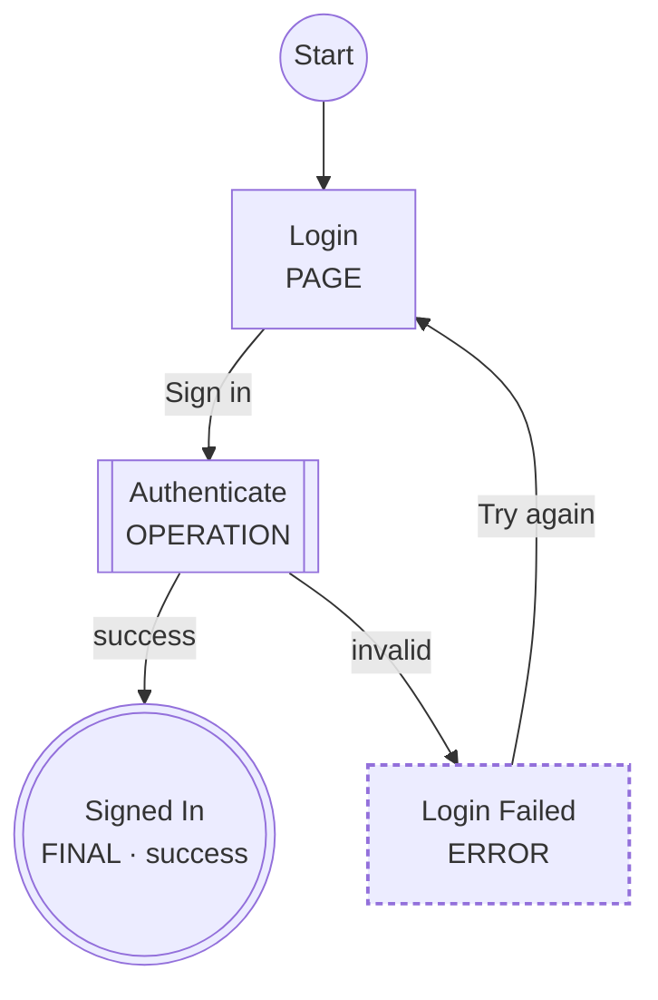

# LogicSpec

**Define the logic. Validate it. Visualize it. Then build it.**

LogicSpec is a small, open-source YAML DSL for describing **application feature logic** — booking, checkout, authentication, onboarding, approval workflows — *before* you implement them.

A feature specification describes:

```text
Pages
   ↓
Actions
   ↓
Decisions
   ↓
Backend Operations
   ↓
Events
   ↓
Outcomes
```

and the toolchain turns it into validated, always-up-to-date diagrams:

```text
YAML
 ↓
Validate
 ↓
Visualize
 ↓
Implement
```

LogicSpec is a **design and specification tool**, not a workflow engine. Nothing is executed. Expressions are descriptive text. The YAML is the source of truth; generated Mermaid is documentation.

## The problem

Software teams (and AI coding agents) usually have:

```text
requirements    design    code
```

but no small, machine-readable source of truth describing how a feature actually behaves — which screens exist, what the user can do, which backend operations run, what happens on conflict, timeout, or failure.

* Generic flowcharts are visual but semantically weak — a box is just a box.
* Workflow engines are far too heavy for design work.
* Mermaid is great for *seeing* a flow, but a diagram is not a data model you can validate or query.

## The solution

Describe the feature once, in YAML, with a small closed vocabulary of nine step types. Then:

* **Validate** it — structural schema checks plus graph-aware semantic analysis (unknown transitions, unreachable steps, dead ends, loops that can never finish), with stable diagnostic codes and "did you mean" suggestions.
* **Visualize** it — deterministic Mermaid flowcharts (and an experimental swimlane view) wrapped in Markdown that renders on GitHub and in VS Code.
* **Query** it — `logicspec inspect --json` gives tools and AI agents a stable, machine-readable model of the feature.

## Quick start (30 seconds)

> LogicSpec is not published to npm yet. Once published:
>
> ```bash
> npm install -g logicspec
> ```
>
> Until then, use the local development setup below.

```bash
git clone <this repository>
cd logicspec
npm install
npm run build
npm link
```

Then:

```bash
mkdir my-flows && cd my-flows

logicspec init                                  # scaffold config, catalogs, example feature
logicspec validate features/signup.feature.yaml # validate one file (or a directory)
logicspec render features/signup.feature.yaml   # generate generated/signup.md with a Mermaid diagram
logicspec watch                                 # re-validate and re-render on every save
```

## A small example

```yaml
version: "1"

feature:
  id: login
  name: Login
  description: User signs in.

start: login-page

actors:
  user: { kind: user }
  web: { kind: frontend, label: Web App }
  auth: { kind: service, label: Auth Service }

context:
  credentials: { type: object }
  sessionId: { type: string }

steps:
  login-page:
    type: page
    label: Login
    actor: web
    route: /login
    actions:
      submit:
        label: Sign in
        produces: [credentials]
        next: authenticate

  authenticate:
    type: operation
    label: Authenticate
    actor: auth
    call: auth.create-session
    requires: [credentials]
    produces: [sessionId]
    on:
      success: { next: done }
      invalid: { next: login-failed }

  login-failed:
    type: error
    label: Login Failed
    message: Invalid credentials.
    actions:
      retry: { label: Try again, next: login-page }

  done:
    type: final
    label: Signed In
    outcome: success
```

`logicspec render` produces a Markdown file containing:



Shapes and the type marker in each label carry the meaning, so diagrams stay readable in light themes, dark themes, print, and monochrome.

A complete workspace — pages, operations, events, error paths, retry loops, service and event catalogs — lives in [`examples/booking/`](examples/booking/).

## The nine step types

| Type | Meaning |
|------|---------|
| `page` | A frontend screen or meaningful UI state, with user actions |
| `decision` | Branching business/application logic (descriptive, never executed) |
| `operation` | Meaningful backend/system work, resolved against the service catalog |
| `event` | Publish a domain event, or wait for one (with timeout) |
| `wait` | Intentional time delay |
| `subflow` | Invoke another feature file |
| `parallel` | Run independent subflows concurrently (`wait: all` or `any`) |
| `error` | A failure, terminal or with recovery actions |
| `final` | A terminal outcome: `success`, `failure`, or `cancelled` |

The vocabulary is deliberately closed — no custom step types. Organization-specific data belongs under namespaced `extensions:`. See [docs/step-types.md](docs/step-types.md) and the full [specification](docs/specification.md).

## CLI

### `logicspec init`

Scaffolds a workspace: `logicspec.config.yaml`, `features/`, `services.yaml`, `events.yaml`, `generated/`, and a working example feature. Never overwrites existing files.

### `logicspec validate <paths...>`

Validates feature files or whole directories (recursively finds `*.feature.yaml`).

```text
Booking (examples/booking/booking.feature.yaml)
  Steps:       19
  Pages:        5
  Operations:   5
  Events:       1
  Errors:       6
  Finals:       2
  Transitions: 28
  Actors:       5
  Outcomes:    success, cancelled

✓ examples/booking/booking.feature.yaml is valid (0 errors, 0 warnings, 1 info)
```

`--strict` treats warnings as errors.

### `logicspec render <paths...>`

Validates first, then writes Markdown with an embedded Mermaid diagram. An invalid specification is never rendered, so a stale-but-correct diagram is never replaced by a misleading one.

Options:

| Flag | Values | Default |
|------|--------|---------|
| `--view` | `flow`, `swimlane` (experimental) | config `render.view`, else `flow` |
| `--format` | `md`, `mermaid` (bare `.mmd`) | `md` |
| `--direction` | `TD`, `TB`, `LR`, `RL`, `BT` | config `render.direction`, else `TD` |
| `--output` | file or directory | config `output.directory`, else `./generated` |

### `logicspec inspect <paths...>`

Human-readable summary of a feature: actors, steps by type, operations called, events referenced, final outcomes. With `--json`, prints a stable machine-readable report — designed for AI agents, CI policies and external tools.

### `logicspec watch [dir]`

Watches the workspace. On every save: parse → validate → print diagnostics → regenerate diagrams *only if valid*. Catalog or config changes re-render everything.

### Exit codes

| Code | Meaning |
|------|---------|
| `0` | valid / success |
| `1` | validation errors |
| `2` | parsing, configuration or usage errors |

## Workspace configuration

`logicspec.config.yaml` (found by walking up from the feature file):

```yaml
version: "1"

features:
  directory: ./features

catalogs:
  services: ./services.yaml
  events: ./events.yaml

output:
  directory: ./generated

render:
  view: flow
  direction: TD
```

CLI flags override configuration. Without a config file, catalog and subflow checks are simply skipped.

## Editor integration

JSON Schemas generated from the canonical Zod schemas ship in [`schemas/`](schemas/). With the YAML language server (e.g. the VS Code YAML extension), add one comment for autocomplete and inline validation:

```yaml
# yaml-language-server: $schema=./node_modules/logicspec/schemas/feature.schema.json
```

Editor integration is optional — the CLI is the reference validator.

## Library API

The CLI is a thin layer over a clean TypeScript API:

```ts
import {
  parseFeature,
  validateFeature,
  normalizeFeature,
  buildGraph,
  renderMermaid,
  renderMarkdown,
  inspectFeature,
  loadWorkspace,
} from "logicspec";

const result = validateFeature(yamlSource, { file: "booking.feature.yaml" });
if (result.valid && result.normalized && result.graph) {
  const markdown = renderMarkdown(result.normalized, result.graph, { view: "flow" });
}
```

Renderers take objects and return strings — no file system access. Validation returns `Diagnostic[]` — no console output. Everything exported from the package root is public API; everything else is internal.

## Using with AI coding agents

Feature YAML files make an excellent behavioral source of truth for AI agents. A `CLAUDE.md` (or equivalent) in your product repository might say:

```markdown
# Feature Logic

Feature behavior is defined in:

features/*.feature.yaml

These YAML files are the behavioral source of truth.

Before implementing or modifying a feature:

1. Read the relevant feature YAML.
2. Run `logicspec validate`.
3. Identify affected pages.
4. Identify backend operations.
5. Identify events.
6. Identify error paths.
7. Do not invent behavior that contradicts the specification.
8. Implement the requested change.
9. Run tests.
10. Run `logicspec validate` again.

Generated Mermaid files are documentation only.

Never infer behavior from generated Mermaid when the YAML disagrees with it.
The YAML is authoritative.
```

`logicspec inspect --json` gives agents the normalized model directly, without parsing YAML themselves.

## Documentation

* [Specification](docs/specification.md) — the language, precisely
* [Step types](docs/step-types.md) — reference with examples
* [Validation](docs/validation.md) — pipeline, diagnostics catalog, exit codes
* [Roadmap](docs/roadmap.md) — where this is going

## Development

```bash
npm install
npm run typecheck
npm run lint
npm test
npm run build
npm run schemas   # regenerate schemas/ from the Zod schemas
```

See [CONTRIBUTING.md](CONTRIBUTING.md) for how to add step types, validation rules, and renderers.

## Design principles

1. The YAML is the source of truth; generated output is never edited by hand.
2. Small, closed vocabulary — one preferred way to express each concept.
3. Declarative, never executable: expressions and conditions are opaque text.
4. Deterministic output — same input, byte-identical diagrams, clean diffs.
5. Diagnostics are data with stable codes, useful to humans, CI, and AI agents alike.

## License

[MIT](LICENSE)
