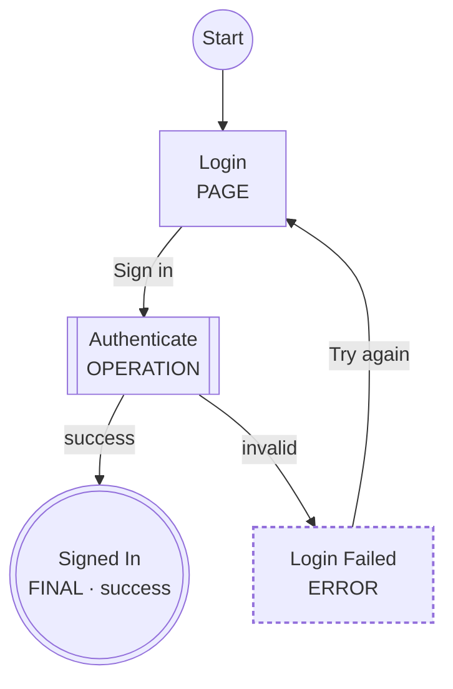

# LogicSpec

[](https://github.com/shynfard/LogicSpec/actions/workflows/ci.yml)
[](LICENSE)


**Define the logic. Validate it. Visualize it. Then build it.**

LogicSpec is a small, open-source YAML DSL for describing **application feature logic** — booking, checkout, authentication, onboarding, approval workflows — *before* you implement them.

A feature specification describes:

```text
Pages
   ↓
Actions
   ↓
Decisions
   ↓
Backend Operations
   ↓
Events
   ↓
Outcomes
```

and the toolchain turns it into validated, always-up-to-date diagrams:

```text
YAML
 ↓
Validate
 ↓
Visualize
 ↓
Implement
```

LogicSpec is a **design and specification tool**, not a workflow engine. Nothing is executed. Expressions are descriptive text. The YAML is the source of truth; generated Mermaid is documentation.

## The problem

Software teams (and AI coding agents) usually have:

```text
requirements    design    code
```

but no small, machine-readable source of truth describing how a feature actually behaves — which screens exist, what the user can do, which backend operations run, what happens on conflict, timeout, or failure.

* Generic flowcharts are visual but semantically weak — a box is just a box.
* Workflow engines are far too heavy for design work.
* Mermaid is great for *seeing* a flow, but a diagram is not a data model you can validate or query.

## The solution

Describe the feature once, in YAML, with a small closed vocabulary of nine step types. Then:

* **Validate** it — structural schema checks plus graph-aware semantic analysis: unknown transitions, unreachable steps, dead ends, loops that can never finish, and data-flow analysis proving every required context variable is produced on every path. Stable diagnostic codes, "did you mean" suggestions, per-workspace severity overrides.
* **Visualize** it — deterministic Mermaid flowcharts, plus experimental swimlane, sequence and event-model views, and a workspace dependency graph — all wrapped in Markdown that renders on GitHub and in VS Code.
* **Query** it — `logicspec inspect --json`, `logicspec validate --json` and the built-in MCP server give tools and AI agents a stable, machine-readable model of every feature.
* **Compare** it — `logicspec diff` reports semantic changes between two versions of a flow, not textual ones.

## Quick start (30 seconds)

```bash
npm install -g logicspec
```

```bash
mkdir my-flows && cd my-flows

logicspec init                                  # scaffold config, catalogs, example feature
logicspec validate features/signup.feature.yaml # validate one file (or a directory)
logicspec render features/signup.feature.yaml   # generate .logicspec/signup.md with a Mermaid diagram
logicspec watch                                 # re-validate and re-render on every save
```

Prefer the editor? Install the **[LogicSpec VS Code extension](https://marketplace.visualstudio.com/items?itemName=Shynfard.logicspec-vscode)** — diagnostics as you type plus an interactive draggable canvas, no CLI required.

### Working from source

```bash
git clone https://github.com/shynfard/LogicSpec.git logicspec
cd logicspec
npm install
npm run build
npm link      # exposes the logicspec CLI from your checkout
```

## A small example

```yaml
version: "1"

feature:
  id: login
  name: Login
  description: User signs in.

start: login-page

actors:
  user: { kind: user }
  web: { kind: frontend, label: Web App }
  auth: { kind: service, label: Auth Service }

context:
  credentials: { type: object }
  sessionId: { type: string }

steps:
  login-page:
    type: page
    label: Login
    actor: web
    route: /login
    actions:
      submit:
        label: Sign in
        produces: [credentials]
        next: authenticate

  authenticate:
    type: operation
    label: Authenticate
    actor: auth
    call: auth.create-session
    requires: [credentials]
    produces: [sessionId]
    on:
      success: { next: done }
      invalid: { next: login-failed }

  login-failed:
    type: error
    label: Login Failed
    message: Invalid credentials.
    actions:
      retry: { label: Try again, next: login-page }

  done:
    type: final
    label: Signed In
    outcome: success
```

`logicspec render` produces a Markdown file containing:



Shapes and the type marker in each label carry the meaning, so diagrams stay readable in light themes, dark themes, print, and monochrome.

A complete workspace lives in [`examples/booking/`](examples/booking/): two features (a booking flow and an event-driven notification flow), service and event catalogs linked to OpenAPI/AsyncAPI documents, severity overrides in the config, and generated output including the [workspace dependency graph](examples/booking/.logicspec/dependencies.md).

## The nine step types

| Type | Meaning |
|------|---------|
| `page` | A frontend screen or meaningful UI state, with user actions |
| `decision` | Branching business/application logic (descriptive, never executed) |
| `operation` | Meaningful backend/system work, resolved against the service catalog |
| `event` | Publish a domain event, or wait for one (with timeout) |
| `wait` | Intentional time delay |
| `subflow` | Invoke another feature file |
| `parallel` | Run independent subflows concurrently (`wait: all` or `any`) |
| `error` | A failure, terminal or with recovery actions |
| `final` | A terminal outcome: `success`, `failure`, or `cancelled` |

The vocabulary is deliberately closed — no custom step types. Organization-specific data belongs under namespaced `extensions:`. See [docs/step-types.md](docs/step-types.md) and the full [specification](docs/specification.md).

## CLI

### `logicspec init`

Scaffolds a workspace: `logicspec.config.yaml`, `features/`, `services.yaml`, `events.yaml`, `.logicspec/`, and a working example feature. Never overwrites existing files.

### `logicspec validate [paths...]`

Validates feature files or whole directories (recursively finds `*.feature.yaml`). With **no paths**, validates the entire surrounding workspace, including catalog-level checks (OpenAPI/AsyncAPI references).

```text
Booking (examples/booking/booking.feature.yaml)
  Steps:       19
  Pages:        5
  Operations:   5
  Events:       1
  Errors:       6
  Finals:       2
  Transitions: 28
  Actors:       5
  Outcomes:    success, cancelled

✓ examples/booking/booking.feature.yaml is valid (0 errors, 0 warnings, 1 info)
```

`--strict` treats warnings as errors. `--json` prints a stable machine-readable report instead:

```json
{
  "valid": false,
  "files": [{ "file": "…", "valid": false, "diagnostics": [], "stats": {} }],
  "workspace": { "diagnostics": [] },
  "summary": { "files": 2, "errors": 1, "warnings": 0, "info": 1 }
}
```

### `logicspec render <paths...>`

Validates first, then writes Markdown with an embedded Mermaid diagram. An invalid specification is never rendered, so a stale-but-correct diagram is never replaced by a misleading one.

Options:

| Flag | Values | Default |
|------|--------|---------|
| `--view` | `flow`; experimental: `swimlane`, `sequence`, `event-model` | config `render.view`, else `flow` |
| `--format` | `md`, `mermaid` (bare `.mmd`) | `md` |
| `--direction` | `TD`, `TB`, `LR`, `RL`, `BT` | config `render.direction`, else `TD` |
| `--output` | file or directory | config `output.directory`, else `./.logicspec` |

The four views answer different questions — flow: *what happens*, swimlane: *who does it*, sequence: *how actors interact*, event-model: *interface / logic / events / outcomes*. See [docs/views.md](docs/views.md).

### `logicspec inspect <paths...>`

Human-readable summary of a feature: actors, steps by type, operations called, events referenced, final outcomes. With `--json`, prints a stable machine-readable report — designed for AI agents, CI policies and external tools.

### `logicspec watch [dir]`

Watches the workspace. On every save: parse → validate → print diagnostics → regenerate diagrams *only if valid*. Changing a feature also re-renders every feature that invokes it as a subflow; catalog or config changes re-render everything.

### `logicspec export [dir]`

Builds the complete workspace artifact set into the output directory (default `.logicspec/` — the project's build folder, like `.next`):

```text
.logicspec/
  booking.md          rendered diagram per feature
  booking.json        stable machine-readable model per feature
  dependencies.md     workspace dependency graph
  workspace.json      index: features, validity, services, events
  diagnostics.json    every finding across the workspace
```

Invalid features never overwrite their previous artifacts; their findings land in `diagnostics.json` and the exit code. Commit the folder if you want the diagrams reviewable on GitHub, or ignore it like any build output — both work.

### `logicspec graph [dir]`

Renders the workspace dependency graph — features, their subflow relationships, and event publish/wait edges — to `.logicspec/dependencies.md`. `--services` adds service nodes; `--format mermaid` writes a bare `.mmd`.


### `logicspec diff <before> <after>`

Semantic comparison of two feature files: added/removed/changed steps, transitions, actors, context variables and outcomes — not a text diff. `--json` emits the structured result for PR tooling. Exit code is `0` whether or not differences exist (`2` if an input does not parse).

### `logicspec mcp [dir]`

Runs the [MCP server](docs/integrations.md#mcp-server) over stdio, exposing the workspace to AI agents.

### Exit codes

| Code | Meaning |
|------|---------|
| `0` | valid / success |
| `1` | validation errors |
| `2` | parsing, configuration or usage errors |

## Workspace configuration

`logicspec.config.yaml` (found by walking up from the feature file):

```yaml
version: "1"

features:
  directory: ./features

catalogs:
  services: ./services.yaml
  events: ./events.yaml

output:
  directory: ./.logicspec

render:
  view: flow          # flow | swimlane | sequence | event-model
  direction: TD

# Optional: promote, demote or disable any diagnostic per workspace.
diagnostics:
  LS200: "error"      # unreachable steps fail validation here
  LS402: "off"        # unused-actor infos are silenced
```

CLI flags override configuration. Without a config file, catalog and subflow checks are simply skipped. Severity overrides apply to feature and workspace-level diagnostics alike, and exit codes follow the *effective* severities.

## Linking catalogs to OpenAPI and AsyncAPI

LogicSpec catalogs identify operations and events; OpenAPI and AsyncAPI describe their contracts. Link them and the references are verified:

```yaml
# services.yaml
services:
  booking:
    operations:
      reserve-slot:
        kind: http
        method: POST
        path: /reservations
        openapi:
          document: ./openapi.yaml     # resolved relative to this catalog
          operationId: reserveSlot     # must exist (LS108); method/path cross-checked (LS403)

# events.yaml
events:
  BookingCreated:
    topic: booking.created
    asyncapi:
      document: ./asyncapi.yaml
      channel: booking.created         # channel key or AsyncAPI 3 address (LS109)
```

Documents are read as plain YAML/JSON; `$ref` indirection is not resolved.

## Editor integration

JSON Schemas generated from the canonical Zod schemas ship in [`schemas/`](schemas/). With the YAML language server (e.g. the VS Code YAML extension), add one comment for autocomplete and inline validation:

```yaml
# yaml-language-server: $schema=./node_modules/logicspec/schemas/feature.schema.json
```

Editor integration is optional — the CLI is the reference validator.

## Library API

The CLI is a thin layer over a clean TypeScript API:

```ts
import {
  parseFeature,
  validateFeature,
  normalizeFeature,
  buildGraph,
  renderMermaid,
  renderMarkdown,
  inspectFeature,
  loadWorkspace,
} from "logicspec";

const result = validateFeature(yamlSource, { file: "booking.feature.yaml" });
if (result.valid && result.normalized && result.graph) {
  const markdown = renderMarkdown(result.normalized, result.graph, { view: "flow" });
}
```

Renderers take objects and return strings — no file system access. Validation returns `Diagnostic[]` — no console output. Everything exported from the package root is public API; everything else is internal.

Browser and web tooling should import from **`logicspec/core`** — the same API minus everything that touches the file system (workspace loading, CLI, MCP). The visual editor is built entirely on it, including the document-preserving edit API (`loadEditableFeature`, `addStep`, `renameStep`, `addTransition`, …).

## Using with AI coding agents

### Claude Code: install the LogicSpec plugin

The fastest way to make Claude fluent in LogicSpec — inside Claude Code run:

```
/plugin marketplace add shynfard/LogicSpec
/plugin install logicspec@logicspec
```

You get three things:

* **The `logicspec-authoring` skill** — Claude learns the nine-step-type vocabulary, the transition rules, data-flow expectations and the validate → fix → render loop, with the full grammar and an LS-code fix table loaded on demand. It activates whenever you work on `*.feature.yaml`, catalogs, or ask to design a flow.
* **Slash commands** — `/logicspec:feature <description>` designs a new spec end to end (sketch → YAML → catalogs → validate until clean → render); `/logicspec:check [path]` validates a workspace and repairs findings by LS code.
* **MCP server** — `logicspec mcp` is registered automatically, so Claude can query `list_features`, `get_feature`, `get_step`, `get_transitions`, `get_service_dependencies`, `get_events` and `validate_feature` structurally instead of re-parsing YAML.

Requires the CLI: `npm install -g logicspec`. Skill-only alternative (no plugin system): copy `integrations/claude-plugin/skills/logicspec-authoring/` into `~/.claude/skills/`.

### Any agent: specs as the source of truth

Feature YAML files make an excellent behavioral source of truth for AI agents. A `CLAUDE.md` (or equivalent) in your product repository might say:

```markdown
# Feature Logic

Feature behavior is defined in:

features/*.feature.yaml

These YAML files are the behavioral source of truth.

Before implementing or modifying a feature:

1. Read the relevant feature YAML.
2. Run `logicspec validate`.
3. Identify affected pages.
4. Identify backend operations.
5. Identify events.
6. Identify error paths.
7. Do not invent behavior that contradicts the specification.
8. Implement the requested change.
9. Run tests.
10. Run `logicspec validate` again.

Generated Mermaid files are documentation only.

Never infer behavior from generated Mermaid when the YAML disagrees with it.
The YAML is authoritative.
```

`logicspec inspect --json` gives agents the normalized model directly, without parsing YAML themselves.

### MCP server

Agents that speak the Model Context Protocol can query the workspace live — no YAML parsing, no shelling out:

```bash
claude mcp add logicspec -- logicspec mcp /path/to/your/workspace
```

Seven tools: `list_features`, `get_feature`, `get_step`, `get_transitions`, `get_service_dependencies`, `get_events`, `validate_feature`. Plain stdio JSON-RPC with zero extra dependencies — any MCP client works. Details in [docs/integrations.md](docs/integrations.md#mcp-server).

## Integrations (experimental)

* **VS Code extension** — [install from the Marketplace](https://marketplace.visualstudio.com/items?itemName=Shynfard.logicspec-vscode) (source: [`integrations/vscode/`](integrations/vscode/)): diagnostics as you type with exact ranges, an **interactive React Flow canvas** (drag nodes, hover to spotlight relations, stable per-actor colors, minimap), four Mermaid views, a step inspector with cross-file links into catalogs and subflows, and a live workspace graph. Fully self-contained — no CLI needed.
* **Visual editor** — [`integrations/editor/`](integrations/editor/): a React Flow canvas with two-way YAML ↔ graph editing — node palette for the nine step types, inspector for labels/actors/transitions, edits written back through a comment-preserving document API. `npm install && npm run dev` inside that directory.
* **Obsidian plugin** — [`integrations/obsidian/`](integrations/obsidian/): renders ` ```logicspec ` blocks (inline feature YAML) and ` ```logicspec-file ` blocks (vault-relative references with `view:`/`direction:` overrides) as validated Mermaid diagrams inside notes, with the full diagnostics list under each diagram and auto re-render when referenced files change. Build inside that directory; copy `dist/` into `<vault>/.obsidian/plugins/logicspec/`.
* **Claude Code plugin** — [`integrations/claude-plugin/`](integrations/claude-plugin/): an authoring skill (DSL rules, diagnostics reference, the validate-fix-render loop), `/logicspec:feature` and `/logicspec:check` commands, and MCP server wiring. Install with `/plugin marketplace add shynfard/LogicSpec` → `/plugin install logicspec@logicspec`.

All are self-contained; the core library never depends on any integration.

## Documentation

* [Specification](docs/specification.md) — the language, precisely
* [Step types](docs/step-types.md) — reference with examples
* [Validation](docs/validation.md) — pipeline, diagnostics catalog, data-flow analysis, exit codes
* [Views](docs/views.md) — the four feature views and the workspace graph
* [Integrations](docs/integrations.md) — MCP server, VS Code extension, visual editor, edit API
* [Roadmap](docs/roadmap.md) — what shipped in 0.5.0, what's next
* [Changelog](CHANGELOG.md)

## Development

```bash
npm install
npm run typecheck
npm run lint
npm test
npm run build
npm run schemas   # regenerate schemas/ from the Zod schemas
```

See [CONTRIBUTING.md](CONTRIBUTING.md) for how to add step types, validation rules, and renderers.

## Design principles

1. The YAML is the source of truth; generated output is never edited by hand.
2. Small, closed vocabulary — one preferred way to express each concept.
3. Declarative, never executable: expressions and conditions are opaque text.
4. Deterministic output — same input, byte-identical diagrams, clean diffs.
5. Diagnostics are data with stable codes, useful to humans, CI, and AI agents alike.

## License

[Apache-2.0](LICENSE)
