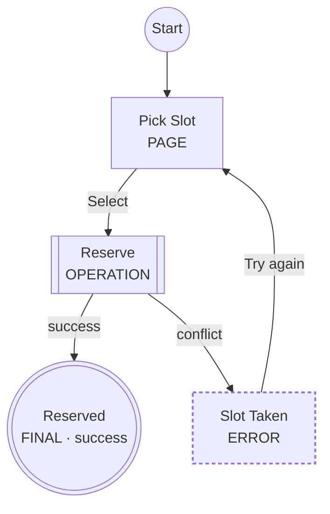
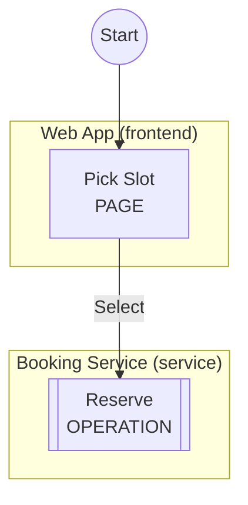
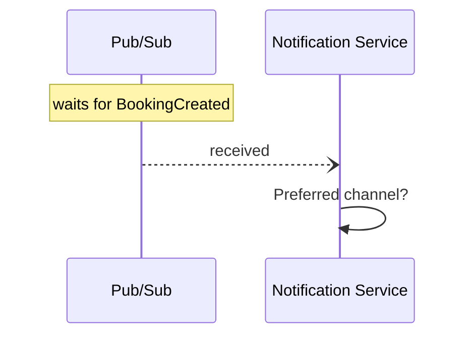
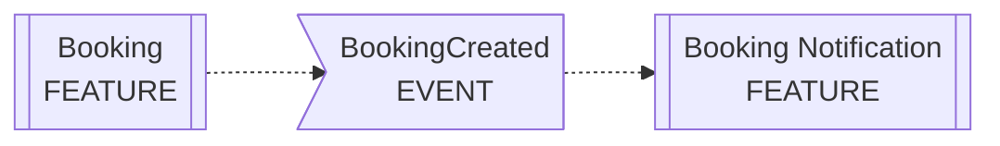

# Views

One specification, several ways to look at it. All views are generated from the same normalized model, are fully deterministic, and escape user text the same way — a label can never break a diagram. `flow` is the stable default; `swimlane`, `sequence` and `event-model` are experimental (their output may be refined between minor versions; their semantics are stable).

Select a view with `logicspec render --view <view>` or per-workspace via `render.view` in `logicspec.config.yaml`.

| View | Question it answers |
|------|---------------------|
| `flow` | What happens, in what order, with which branches? |
| `swimlane` | Who is responsible for each step? |
| `sequence` | How do the actors interact? |
| `event-model` | How do interface, logic, events and outcomes relate? |
| `logicspec graph` | How do *features* relate across the workspace? |

## `flow` (default)

A Mermaid flowchart. One node per step; shape **and** an uppercase type marker carry the step type, so the diagram survives dark themes, print and monochrome. Waiting-event edges are dotted; every other edge is solid and labeled with the action, outcome, case or duration that causes it.

Shapes: page → rectangle, decision → diamond, operation/subflow → subroutine, event → flag, wait → stadium, parallel → parallelogram, error → marked rectangle, final → double circle.

## `swimlane` (experimental)

The same graph, grouped into one subgraph lane per actor (declaration order), with steps that have no actor collected in an `Unassigned` lane. Implemented with flowchart subgraphs for maximum renderer compatibility; it will migrate to native Mermaid swimlanes once support is widespread.

## `sequence` (experimental)

A Mermaid `sequenceDiagram`: actors (and `Unassigned`) become participants; every transition becomes a message from the source step's actor to the target step's actor, labeled with the edge label (falling back to the target step's label). Event edges use async dotted arrows; waits and event publishes/waits get `Note over` annotations.

**This is an interaction map, not a temporal trace.** A branching graph has no single timeline; messages appear in source order, one per transition, including mutually exclusive branches.

## `event-model` (experimental)

An event-modeling-inspired projection: the same nodes and edges as `flow`, arranged into four horizontal lanes —

| Lane | Step types |
|------|-----------|
| Interface | `page` |
| Logic | `operation`, `decision`, `subflow`, `parallel`, `wait` |
| Events | `event` |
| Outcomes | `final`, `error` |

Empty lanes are omitted. Useful for spotting features whose logic never emits events, or whose events feed nothing.

## Workspace dependency graph (`logicspec graph`)

Not a per-feature view: one diagram for the whole workspace showing features (subroutine shape), the events they publish or wait for (flag shape, dotted edges), subflow invocations (`-- "subflow" -->` edges), and — with `--services` — the services they call. A subflow target that doesn't resolve to any workspace feature is drawn with a `?` marker so dangling references stay visible.

Output goes to `<output.directory>/dependencies.md` (or `.mmd` with `--format mermaid`).
