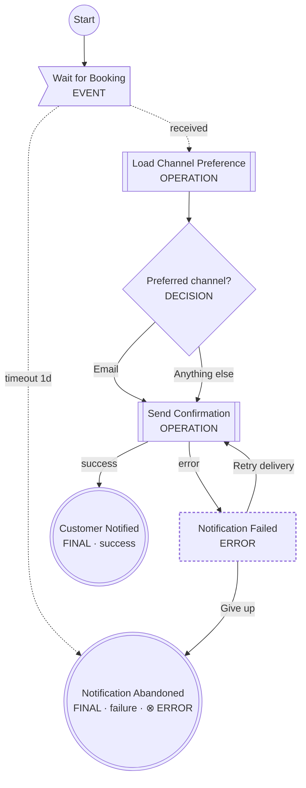

# Booking Notification

> **GENERATED FILE — DO NOT EDIT.**
>
> Source: `examples/booking/notify-booking.feature.yaml`
> Regenerate with `logicspec render examples/booking/notify-booking.feature.yaml`.

Sends the customer a confirmation after a booking is created.

## Actors

- **Notification Service** (`notification`, service)
- **Pub/Sub** (`pubsub`, broker)
